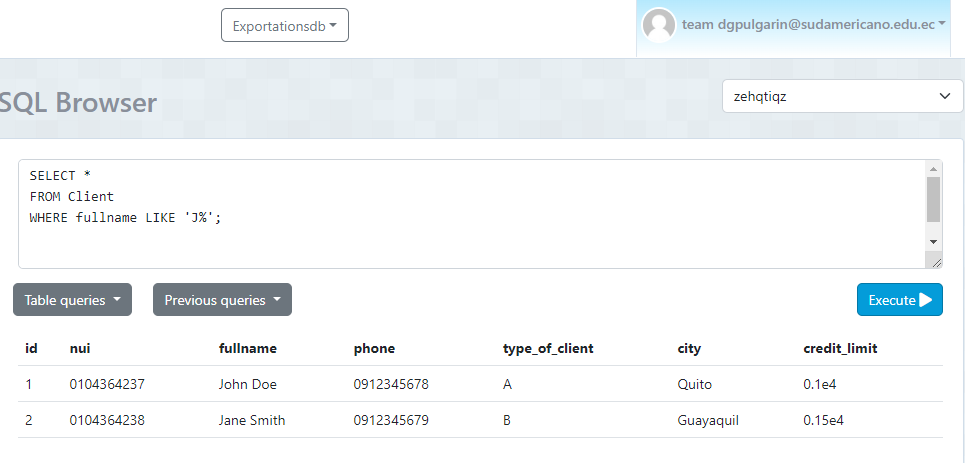

# Sentencias SQL y Capturas

## 1. Contar el número de productos de una categoría específica
### Sentencia
SELECT COUNT(*) 
FROM Product 
WHERE category = 'Audio';

## 2. Contar el número de clientes en una ciudad específica
### Sentencia
SELECT COUNT(*) 
FROM Client 
WHERE city = 'Cuenca';

## 3. Contar el número de productos cuyo precio está dentro de un rango específico
### Sentencia
SELECT COUNT(*) 
FROM Product 
WHERE price BETWEEN 500 AND 1000;

## 4. Seleccionar clientes que viven en una ciudad específica y tienen un tipo de cliente específico
### Sentencia
SELECT * 
FROM Client 
WHERE city = 'Quito' AND type_of_client = 'A';

## 5. Seleccionar productos que pertenecen a una categoría específica y cuyo precio está por encima de un valor específico
### Sentencia
SELECT * 
FROM Product 
WHERE category = 'Audio' AND price > 500;

## 6. Seleccionar productos que fueron producidos en un año específico y en un país de origen específico
### Sentencia

SELECT * 
FROM Product 
WHERE year_of_product = 2022 AND country_of_origin = 'China';

## 7. Seleccionar clientes cuyo nombre completo comience con 'J'
### Sentencia
SELECT * 
FROM Client 
WHERE fullname LIKE 'J%';

## 8. Seleccionar clientes cuya ciudad contenga la letra 'a'
### Sentencia
SELECT * 
FROM Client 
WHERE city LIKE '%a%';

