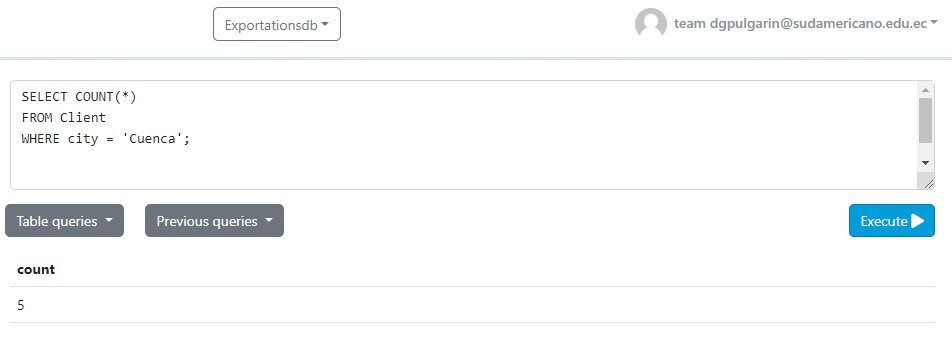
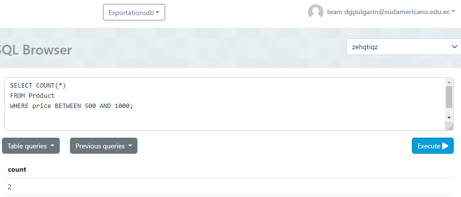
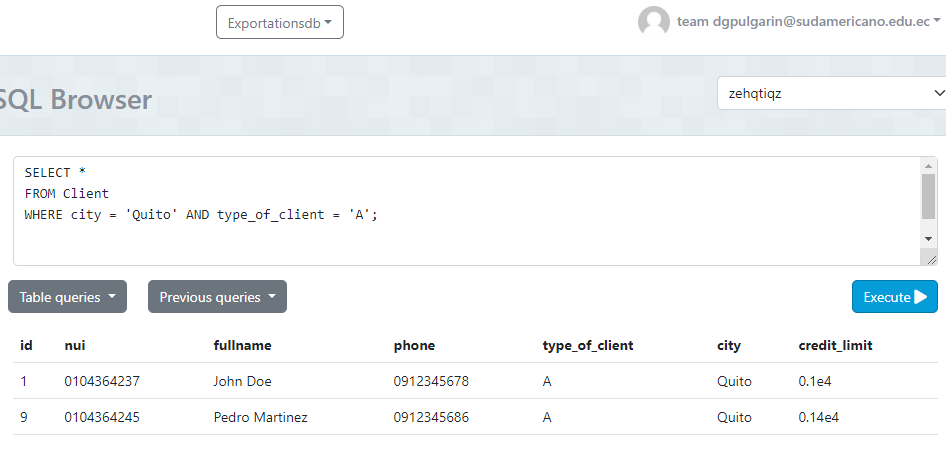
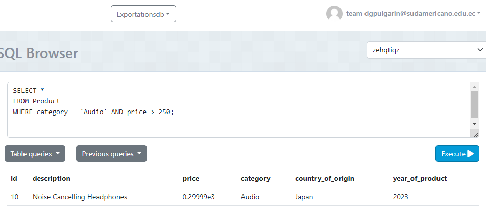
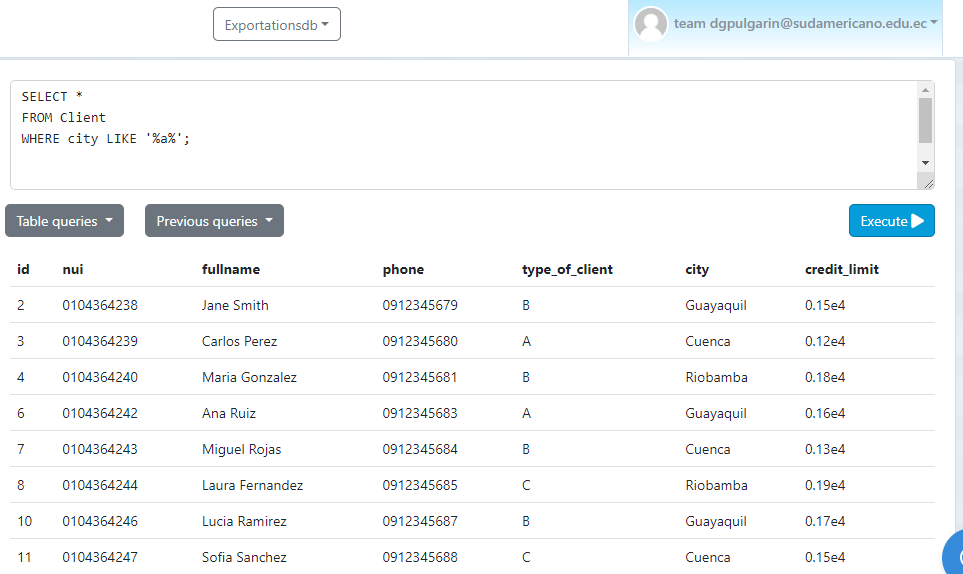

# Sentencias SQL y Resultados

## 1. Contar el número de productos de una categoría específica

## 2. Contar el número de clientes en una ciudad específica

## 3. Contar el número de productos cuyo precio está dentro de un rango específico

## 4. Seleccionar clientes que viven en una ciudad específica y tienen un tipo de cliente específico

## 5. Seleccionar productos que pertenecen a una categoría específica y cuyo precio está por encima de un valor específico

## 6. Seleccionar productos que fueron producidos en un año específico y en un país de origen específico

## 7. Seleccionar clientes cuyo nombre completo comience con 'J'

## 8. Seleccionar clientes cuya ciudad contenga la letra 'a'

